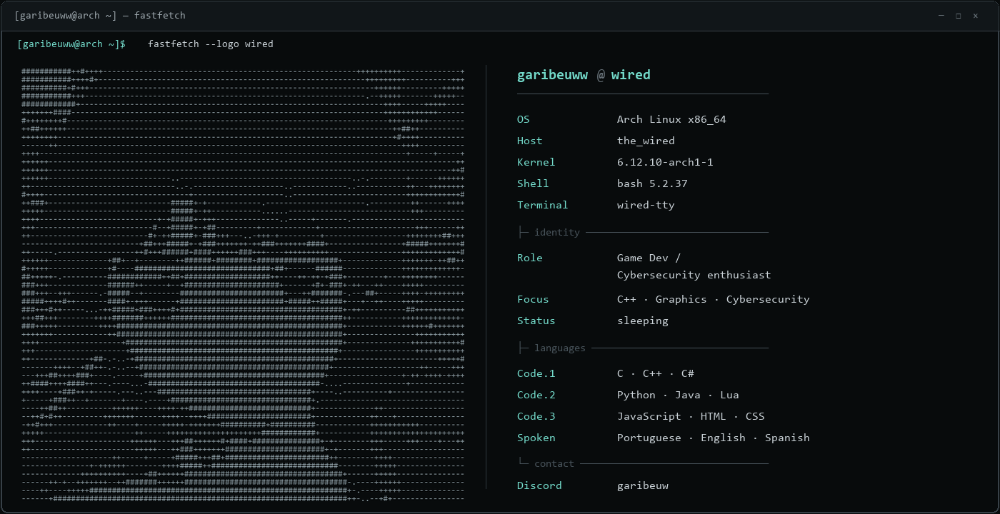

<div align="center">

<h3><code>garibeuww@github ~ $ ./portfolio.sh</code></h3>

<picture>
  <source media="(prefers-color-scheme: light)" srcset="https://www.gitskins.com/api/section/wordmark?username=garibeuww&theme=github-dark&style=terminal&label=garibeuww&mode=light" />
  
</picture>

<p><b>“De nada tenho certeza, mas a visão das estrelas me faz sonhar.”</b></p>

</div>

---

## `> whoami`

<div align="center">



</div>

```bash
$ cat /proc/profile

NAME     = garibeuww
PROJECT  = Faber Engine
MISSION  = Learning what happens behind the games we play
INTEREST = Engines | Graphics | Tools | Low-level systems
STATUS   = Building | Learning | Shipping
```

---

## `> ls /tech-stack`

<picture>
  <source media="(prefers-color-scheme: light)" srcset="https://www.gitskins.com/api/section/stack?username=garibeuww&theme=github-dark&style=terminal&mode=light" />
  
</picture>

<details>
<summary><code>show installed packages</code></summary>

```text
systems/   C  C++  C#  CMake
runtime/   Python  Java  Lua
web/       JavaScript  HTML  CSS
graphics/  OpenGL
tools/     Git  Bash
```

</details>

---

## `> git stats --global`

<picture>
  <source media="(prefers-color-scheme: light)" srcset="https://www.gitskins.com/api/section/stats?username=garibeuww&theme=github-dark&style=terminal&mode=light" />
  
</picture>

<picture>
  <source media="(prefers-color-scheme: light)" srcset="https://www.gitskins.com/api/section/heatmap?username=garibeuww&theme=github-dark&style=terminal&mode=light" />
  
</picture>

---

## `> ping me`

<div align="center">

<a href="https://github.com/garibeuww"><code>github.com/garibeuww</code></a>

</div>

```console
lain@wired:~$ ping garibeuww
64 bytes from somewhere-in-the-wired: connected

lain@wired:~$ logout
Connection to the Wired remains open.
█
```

<p align="center">
  <sub>garibeuww · layer 07 · terminal portfolio powered by <a href="https://www.gitskins.com/readme-generator">GitSkins</a></sub>
</p>
